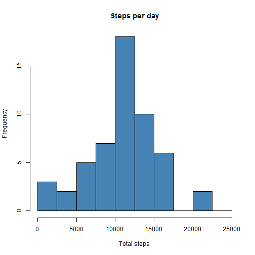
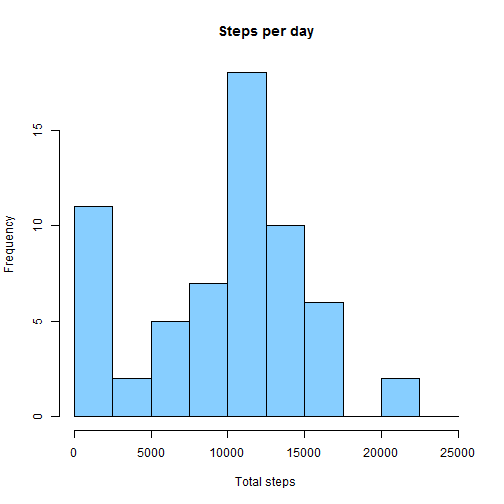
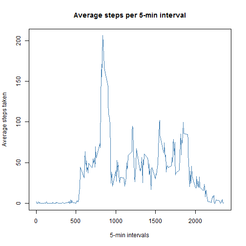
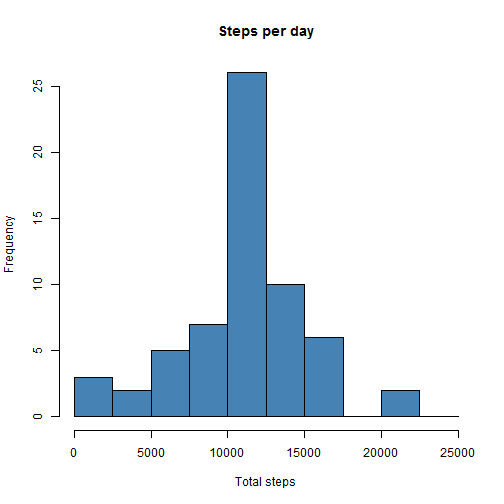
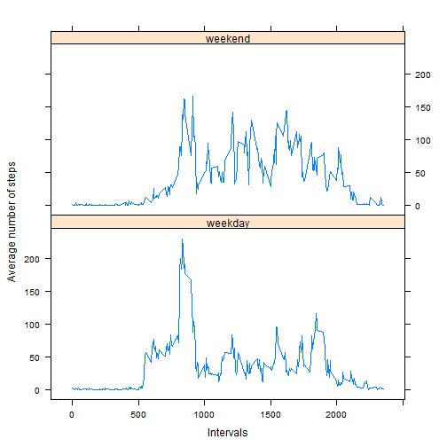

# Loading and preprocessing the data

```r
library(plyr)
```

Show any code that is needed to
1.Load the data (i.e. read.csv())
2.Process/transform the data (if necessary) into a format suitable for your analysis

## Loading file


```r
urlLink <- "https://d396qusza40orc.cloudfront.net/repdata%2Fdata%2Factivity.zip"

if(!file.exists("activity.csv"))
	{
	temp <- tempfile()
	download.file(urlLink, temp)
	rawdata <- unzip(temp)
	unlink(temp)
 	print("File downloaded and unzipped successfully")
	}
```

## Preprocessing data

```r
data <- read.csv("activity.csv", header=T,  colClasses = c("numeric", "character", "numeric"))
data$date <- as.Date(data$date, format = "%Y-%m-%d")
str(data)
```

```
## 'data.frame':	17568 obs. of  3 variables:
##  $ steps   : num  NA NA NA NA NA NA NA NA NA NA ...
##  $ date    : Date, format: "2012-10-01" "2012-10-01" ...
##  $ interval: num  0 5 10 15 20 25 30 35 40 45 ...
```
# What is mean total number of steps taken per day?

ALTERNATIVE 1: This method will drop the days which have 'NA' steps.

Using aggregate function to calculate total steps in a day


```r
stepsDay_01 <- aggregate(steps ~ date, data = data, sum, na.rm = TRUE)
head(stepsDay_01)
```

```
##         date steps
## 1 2012-10-02   126
## 2 2012-10-03 11352
## 3 2012-10-04 12116
## 4 2012-10-05 13294
## 5 2012-10-06 15420
## 6 2012-10-07 11015
```

The histogram is as follows:


```r
hist(stepsDay_01$steps, main="Steps per day", col="steelblue", breaks=seq(from=0, to=25000, by=2500), xlab="Total steps")
```

 


```r
mean(stepsDay_01$steps)
```

```
## [1] 10766.19
```

```r
median(stepsDay_01$steps)
```

```
## [1] 10765
```

ALTERNATIVE 2: This method will keep the days even if they have 'NA' steps. This will produce a 'mean' and 'median' value which are different from "Alternative 1."


```r
stepsDay_02 <- tapply(data$steps, data$date,  sum,  na.rm=T)
hist(stepsDay_02, main="Steps per day", col="skyblue1", breaks=seq(from=0, to=25000, by=2500), xlab="Total steps")
```

 


```r
mean(stepsDay_02)
```

```
## [1] 9354.23
```

```r
median(stepsDay_02)
```

```
## [1] 10395
```
# What is the average daily activity pattern?


1. Make a time series plot (i.e. type = “l”) of the 5-minute interval (x-axis) and the average number of steps taken, averaged across all days (y-axis)

Take out the mean steps for every time interval and plot the graph


```r
steps_int <- tapply(data$steps, data$interval, mean, na.rm=T)

plot(as.numeric(row.names(steps_int)), steps_int, type="l", xlab="5-min intervals", ylab="Average steps taken", main="Average steps per 5-min interval", col="steelblue")
```

 

2. Which 5-minute interval, on average across all the days in the dataset, contains the maximum number of steps?

```r
names(which.max(steps_int))
```

```
## [1] "835"
```

## Imputing missing values


Note that there are a number of days/intervals where there are missing values (coded as NA). The presence of missing days may introduce bias into some calculations or summaries of the data.

1. Calculate and report the total number of missing values in the dataset (i.e. the total number of rows with NAs)

Calculating total number of missing values:


```r
sum(is.na(data$steps))
```

```
## [1] 2304
```

2. Devise a strategy for filling in all of the missing values in the dataset. The strategy does not need to be sophisticated.

The folowing code fills up the "NA"s with mean value of steps for the corresponding interval

```r
        imp <- data
        intAvg <- tapply(data$steps, data$interval, mean, na.rm=T)
        for (i in 1:length(imp$steps))
        {
                if(is.na(imp[i,1]))
                {
                        for (j in 1:length(intAvg))
                        {
                          if (imp[i,3]==as.numeric(row.names(intAvg)[j]))
                          {
                           imp[i,1]<-intAvg[[j]]
                          }
                        }
                }
                
        }
        head(imp)
```

```
##       steps       date interval
## 1 1.7169811 2012-10-01        0
## 2 0.3396226 2012-10-01        5
## 3 0.1320755 2012-10-01       10
## 4 0.1509434 2012-10-01       15
## 5 0.0754717 2012-10-01       20
## 6 2.0943396 2012-10-01       25
```

3.Create a new dataset that is equal to the original dataset but with the missing data filled in.
The new data set is called "imp" (as in imputed)


```r
newData<-imp
str(newData)
```

```
## 'data.frame':	17568 obs. of  3 variables:
##  $ steps   : num  1.717 0.3396 0.1321 0.1509 0.0755 ...
##  $ date    : Date, format: "2012-10-01" "2012-10-01" ...
##  $ interval: num  0 5 10 15 20 25 30 35 40 45 ...
```

4. Make a histogram of the total number of steps taken each day and Calculate and report the mean and median total number of steps taken per day. Do these values differ from the estimates from the first part of the assignment? What is the impact of imputing missing data on the estimates of the total daily number of steps?

Using aggregate function to calculate total steps in a day


```r
stepsDay_03 <- aggregate(steps ~ date, data = imp, sum, na.rm = TRUE)
head(stepsDay_03)
```

```
##         date    steps
## 1 2012-10-01 10766.19
## 2 2012-10-02   126.00
## 3 2012-10-03 11352.00
## 4 2012-10-04 12116.00
## 5 2012-10-05 13294.00
## 6 2012-10-06 15420.00
```


```r
hist(stepsDay_03$steps, main="Steps per day", col="steelblue", breaks=seq(from=0, to=25000, by=2500), xlab="Total steps")
```

 

```r
mean(stepsDay_03$steps)
```

```
## [1] 10766.19
```

```r
median(stepsDay_03$steps)
```

```
## [1] 10766.19
```

# Are there differences in activity patterns between weekdays and weekends?


For this part the weekdays() function may be of some help here. Use the dataset with the filled-in missing values for this part.
1. Create a new factor variable in the dataset with two levels – “weekday” and “weekend” indicating whether a given date is a weekday or weekend day.


```r
newData$daytype<-ifelse(weekdays(newData$date) %in% c("Saturday", "Sunday"), "weekend", "weekday")
newData$daytype<-factor(newData$daytype)
str(newData)
```

```
## 'data.frame':	17568 obs. of  4 variables:
##  $ steps   : num  1.717 0.3396 0.1321 0.1509 0.0755 ...
##  $ date    : Date, format: "2012-10-01" "2012-10-01" ...
##  $ interval: num  0 5 10 15 20 25 30 35 40 45 ...
##  $ daytype : Factor w/ 2 levels "weekday","weekend": 1 1 1 1 1 1 1 1 1 1 ...
```

2.Make a panel plot containing a time series plot (i.e. type = "l") of the 5-minute interval (x-axis) and the average number of steps taken, averaged across all weekday days or weekend days (y-axis). See the README file in the GitHub repository to see an example of what this plot should look like using simulated data.


```r
library(lattice)
stepsDay_04 <- aggregate(steps~interval+daytype, data=newData, mean)
xyplot(steps ~ interval | daytype, data=stepsDay_04, type='l', layout=c(1,2), xlab = "Intervals", ylab = "Average number of steps")
```

 

### End of assignment


